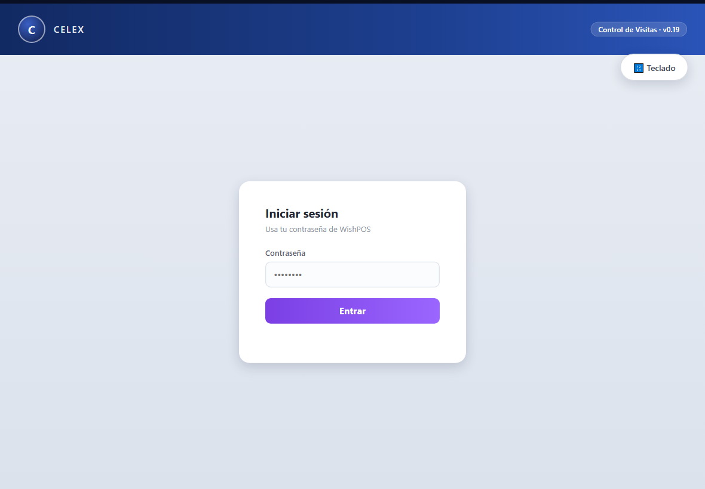
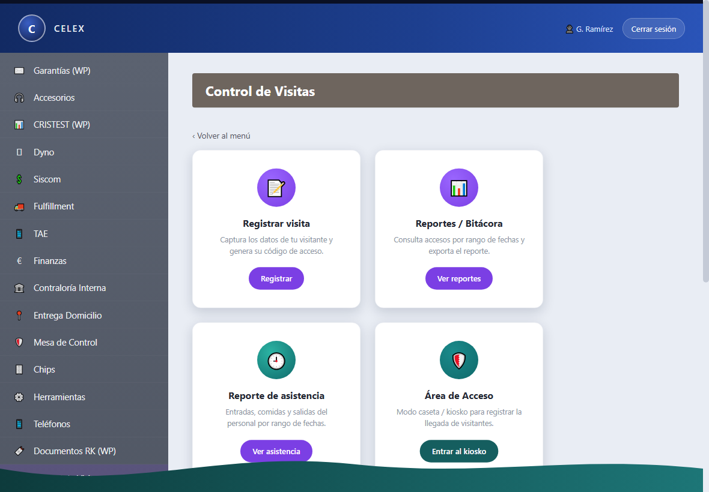
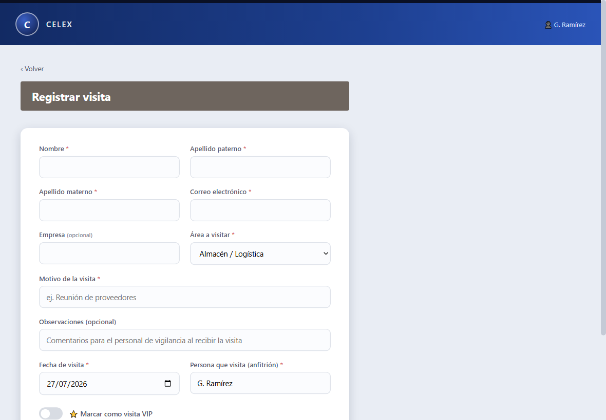
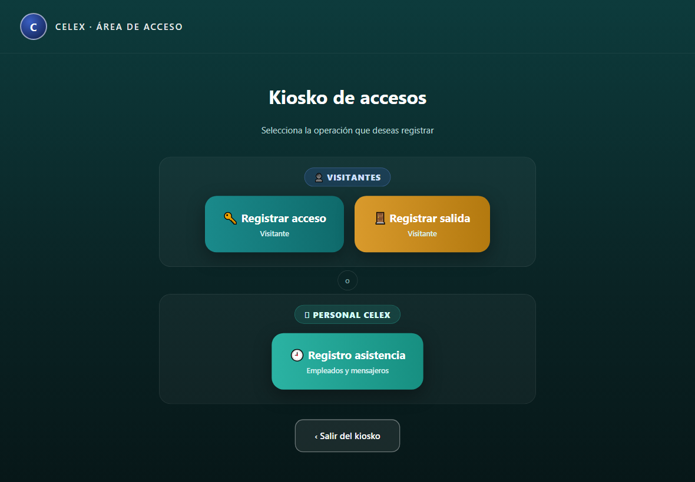
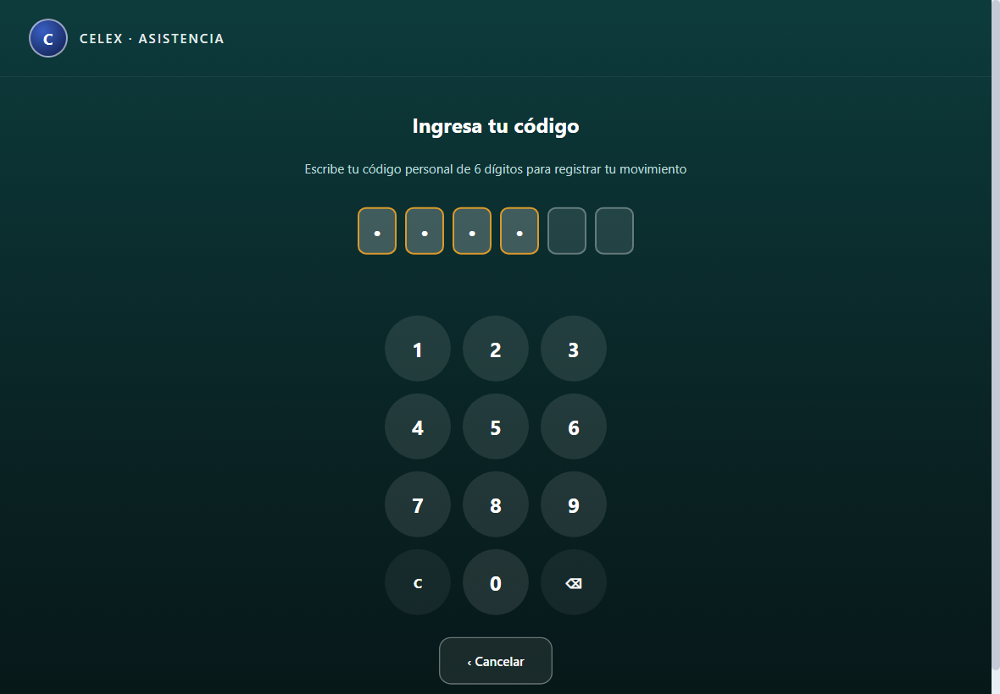
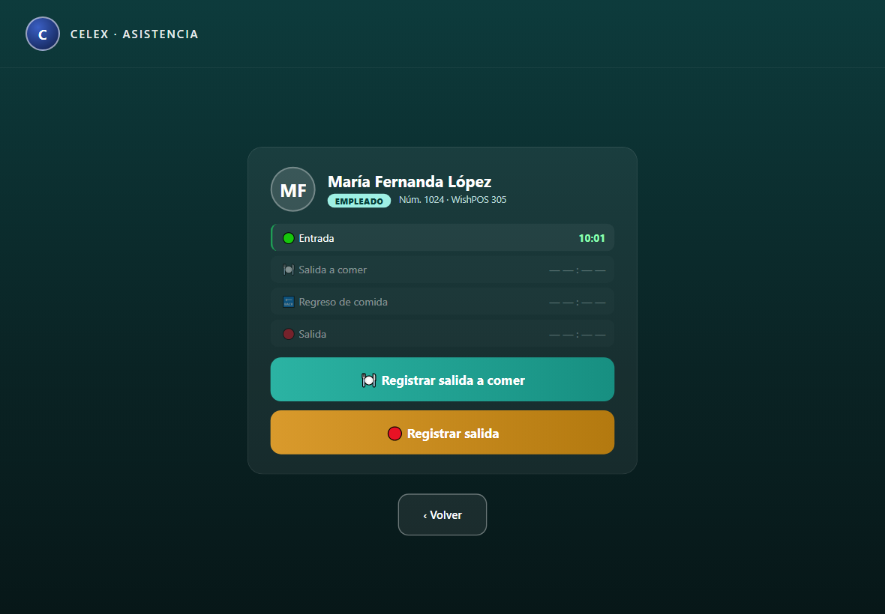
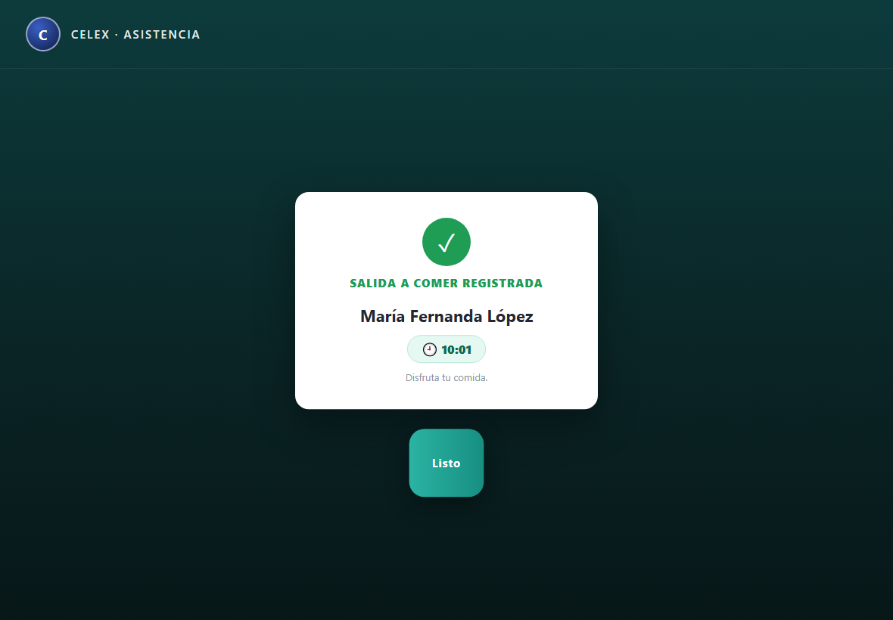
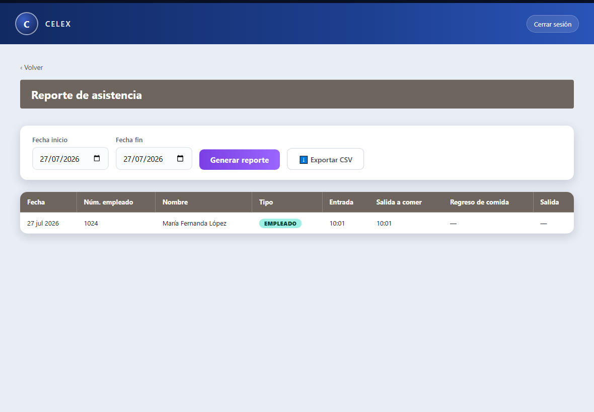
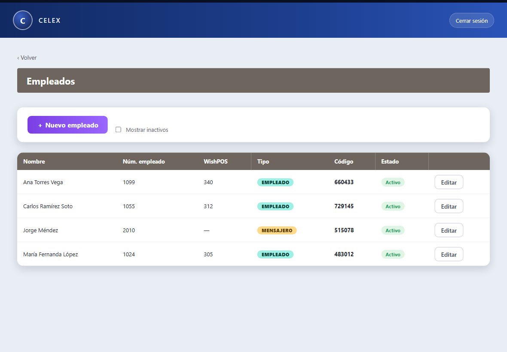
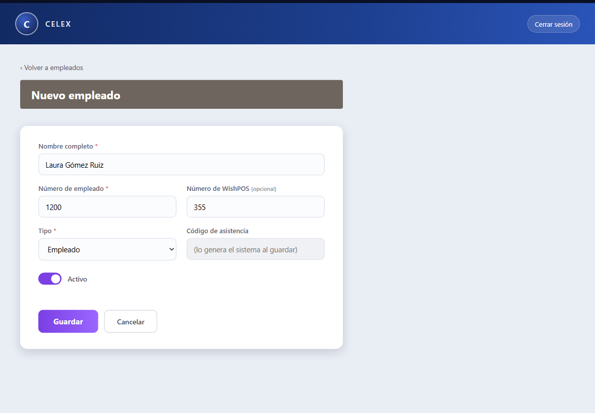

# Manual de uso — Control de Visitas (Celex)

Sistema para registrar y controlar el acceso de **visitantes** y la
**asistencia del personal** (empleados y mensajeros): reemplaza la bitácora de
papel por un flujo digital con **código de acceso**, **foto** y **código de
salida**, todo consultable en reportes.

> Versión del sistema: **v0.19**

---

## 1. Conceptos clave (léelo primero)

- **Código de acceso** (visitante, 6 dígitos): se genera al **registrar** la
  visita y se le comparte al visitante (además, le llega por correo). Lo teclea
  en la caseta para registrar su llegada. Sirve **una sola vez** y solo el
  **día** para el que se registró la visita.
- **Código de salida** (visitante, 6 dígitos): es **distinto** al de acceso. Se
  genera **cuando la visita entra** (al validar el acceso) y aparece en su
  etiqueta. El visitante lo conserva y lo usa al salir.
- **Código de asistencia** (personal, 6 dígitos): es el código **personal** de
  cada empleado o mensajero. **Lo genera el sistema** al darlo de alta (no se
  captura a mano) y es permanente. Con él, el personal registra su asistencia
  en el kiosko.
- **Estados de una visita:**
  - **Pendiente** — registrada, aún no llega.
  - **Dentro** — ya registró su acceso, sigue en las instalaciones.
  - **Salida registrada** — ya entró y salió.
  - **Cancelada** — se anuló antes de que entrara.

---

## 2. Iniciar sesión

1. Abre el sistema en el navegador.
2. Escribe tu **contraseña de WishPOS** (no se pide usuario) y presiona
   **Entrar**.
3. Entras al **Menú**; da clic en **Control de Visitas** para abrir el módulo.

> Si tu contraseña es rechazada, verifica que sea la misma de WishPOS. El
> sistema no crea usuarios nuevos.

---

## 3. El módulo Control de Visitas

Verás las siguientes tarjetas (las de **Empleados** y **Configuración** solo
aparecen si tu usuario tiene el permiso correspondiente):

| Tarjeta | Para qué sirve |
|---|---|
| 📝 **Registrar visita** | Capturar un visitante y generar su código de acceso. |
| 📋 **Mis visitas** | Consultar, editar o cancelar las visitas que tú registraste. |
| 📊 **Reportes / Bitácora** | Consultar accesos de visitantes por fechas y exportar a CSV. |
| 🕘 **Reporte de asistencia** | Entradas, comidas y salidas del personal por fechas. |
| 🛡️ **Área de Acceso** | Modo caseta/kiosko (visitantes y asistencia de personal). |
| 👥 **Empleados** | Alta y administración del padrón (solo usuarios autorizados). |
| ⚙️ **Configuración** | Parámetros del sistema (solo usuarios autorizados). |

---

## 4. Registrar una visita

1. En el módulo, entra a **Registrar visita**.
2. Llena los campos (los marcados con \* son obligatorios):
   - Nombre, Apellido paterno, Apellido materno \*
   - Correo electrónico \* — a esta dirección le llega el código de acceso.
   - Empresa (opcional), Área a visitar \*, Motivo de la visita \*
   - **Observaciones** (opcional) — comentarios para que **vigilancia** los
     tenga en cuenta al recibir a la visita.
   - Fecha de visita \* — el acceso solo se permitirá ese día.
   - Persona que visita (anfitrión) \*
   - **⭐ Marcar como visita VIP** — *solo aparece si tu usuario está
     autorizado* (ver Configuración).
   - **¿El visitante trae vehículo?** — si lo activas, captura Marca, Modelo y
     Placas.
3. Presiona **Generar código de acceso**.

4. La pantalla muestra el **código de acceso de 6 dígitos** y un resumen.
   - El visitante lo recibe **automáticamente por correo**.
   - Puedes copiarlo para compartirlo por otro medio.

> El visitante necesita este código **el día de su visita** para registrar su
> llegada en la caseta.

---

## 5. Mis visitas (consultar / editar / cancelar)

En **Mis visitas** ves la lista de lo que tú registraste, con su estado, foto
(si ya entró) y etiqueta ⭐ VIP cuando aplica.

- **Editar** — solo disponible mientras la visita está **Pendiente**. Una vez
  que el visitante entró, el botón Editar queda deshabilitado.
- **Cancelar** — dentro de la edición, botón **"Cancelar esta visita"** (pide
  confirmación). Solo mientras esté **Pendiente**. Al cancelarla, su código de
  acceso deja de funcionar.
- **Volver sin guardar** — sale de la edición sin aplicar cambios.

---

## 6. Modo caseta / Área de Acceso

Pensado para el equipo de la caseta. Entra con **Área de Acceso → Entrar al
kiosko**. La pantalla separa claramente **dos grupos** para no confundir al
visitante con el personal:

- **👤 Visitantes** — Registrar acceso / Registrar salida.
- **🕘 Personal Celex** — Registro de asistencia (empleados y mensajeros).

### 6.1 Registrar acceso de un visitante (llegada)

1. Toca **🔑 Registrar acceso**.
2. El visitante teclea su **código de acceso de 6 dígitos**.
3. **Confirma identidad**: escribe el **apellido paterno** tal como se
   registró y presiona **Validar**.
4. **Foto**: toma la fotografía del visitante (**Tomar foto** → **Usar esta
   foto**, o **Repetir foto**). Si no hay cámara, se puede **Continuar sin
   foto**.
5. Aparece la **etiqueta de acceso** con nombre, área, anfitrión, la marca
   **⭐ VISITA VIP** si aplica, y el **código de salida** (que el visitante
   debe conservar). Se puede **Imprimir etiqueta**.

**Mensajes posibles al validar:**
- *Código no reconocido* — mal tecleado o no existe.
- *Este código ya fue utilizado* — ya se registró el acceso con él.
- *Esta visita fue cancelada* — solicitar apoyo en recepción.
- *Esta visita está registrada para el [fecha], no para hoy* — el acceso solo
  es válido el día registrado.
- *Apellido no coincide* — hay hasta **3 intentos**; tras el tercero se pide
  apoyo a seguridad/recepción.

### 6.2 Registrar salida de un visitante

1. Toca **🚪 Registrar salida**.
2. El visitante teclea su **código de salida**.
3. Aparece **"¿Eres tú?"** con su nombre y hora de entrada para confirmar:
   - **✅ Confirmar salida** — registra la salida y muestra el tiempo de
     estancia.
   - **❌ No soy yo** — regresa para volver a teclear.

### 6.3 Registro de asistencia del personal

Para **empleados y mensajeros**. Toca **🕘 Registro asistencia**.

1. El colaborador teclea su **código de asistencia de 6 dígitos**.

2. El sistema lo identifica contra el **padrón de empleados**.
   - Si es su **primera marca del día**, se registra la **Entrada** y se le
     pide una **foto** (igual que a los visitantes). Ahí termina para los
     **mensajeros** (solo registran entrada).
   - Si ya tiene entrada, y es **empleado**, aparece su **panel del día** con
     la línea de tiempo y los botones válidos.

3. El empleado registra, **en orden**: **Salida a comer → Regreso de comida →
   Salida**. Se permite la **salida anticipada** (omitir la comida y marcar
   directo la Salida). Cada marca muestra una confirmación:

> El código de asistencia es **personal y permanente**; no se comparte. Si un
> empleado lo olvida, se consulta en **Empleados** (ver §9).

### 6.4 Salir del kiosko

El botón **‹ Salir del kiosko** **cierra la sesión** por completo (para no
dejar la cuenta abierta en el equipo de la caseta).

---

## 7. Reportes / Bitácora de visitantes

1. Entra a **Reportes / Bitácora**.
2. Elige el **rango de fechas** (Desde / Hasta) y presiona **Generar reporte**.
3. La tabla muestra cada visita: visitante, empresa, área, anfitrión, fecha,
   **estado**, registro, acceso, código de salida, salida y duración.
4. **Exportar CSV** descarga exactamente lo que ves en pantalla (abre en Excel).

---

## 8. Reporte de asistencia

1. Entra a **Reporte de asistencia**.
2. Elige el **rango de fechas** y presiona **Generar reporte**.
3. La tabla muestra, por empleado y día: **Entrada, Salida a comer, Regreso de
   comida y Salida**, con el tipo (Empleado / Mensajero).
4. **Exportar CSV** descarga el reporte (abre en Excel).

---

## 9. Empleados (padrón) — solo usuarios autorizados

La tarjeta 👥 **Empleados** administra al personal que registra asistencia.

- **＋ Nuevo empleado** — captura Nombre, Número de empleado, Número de WishPOS
  (opcional) y Tipo (**Empleado** o **Mensajero**). **El código de asistencia
  lo genera el sistema automáticamente** (6 dígitos) y se muestra al guardar
  para que se lo comuniques al colaborador.

- **Editar** — actualiza los datos; el código **no cambia**.
- **Activar / inactivar** — un empleado inactivo ya no puede registrar
  asistencia (su código se libera). Usa **"Mostrar inactivos"** para verlos.

> **Carga desde otro sistema (para el área de sistemas):** se puede cargar el
> personal directo en la base de datos. Existen dos procedimientos:
> `sp_CV_Empleados_Alta` (da de alta uno y devuelve su código) y
> `sp_CV_Empleados_GenerarCodigosFaltantes` (para carga masiva: se insertan los
> renglones sin código y el procedimiento asigna a cada uno un código único).

---

## 10. Configuración (solo usuarios autorizados)

La tarjeta ⚙️ **Configuración** permite ajustar:

- **Ruta de fotos** — carpeta del servidor donde se guardan las fotos.
- **Prefijo del nombre de archivo** y **Dígitos del ID** — arman el nombre de
  cada foto (ej. `CV0000000001.jpg`).
- **Usuarios que pueden marcar visitas VIP**, **usuarios que entran directo al
  kiosko**, **usuarios reclutadores** — listas de **IDs de usuario** separados
  por coma.

> **Importante:** un cambio en estas listas surte efecto la **próxima vez que
> esa persona inicie sesión**.

---

## 11. Preguntas frecuentes

- **¿El visitante puede entrar otro día con el mismo código?**
  No. El código de acceso solo funciona el día registrado y una sola vez.

- **¿Quién define el código de asistencia del empleado?**
  Lo **genera el sistema** al darlo de alta; no se captura. Se muestra en el
  alta y se puede consultar después en **Empleados**.

- **Un mensajero, ¿marca comida y salida?**
  No. Los mensajeros **solo registran entrada**.

- **Un empleado se fue sin marcar la comida, ¿puede marcar salida?**
  Sí. Se permite la **salida anticipada**: basta con haber marcado la entrada.

- **La cámara no funciona en la caseta.**
  La toma de foto requiere que el sistema se abra por **HTTPS** (sitio seguro).
  Si no hay cámara disponible, usa **Continuar sin foto**.

- **El visitante no recibió el correo.**
  Verifica que el correo capturado sea correcto y reporta a soporte (el envío
  depende de un proceso del servidor).
